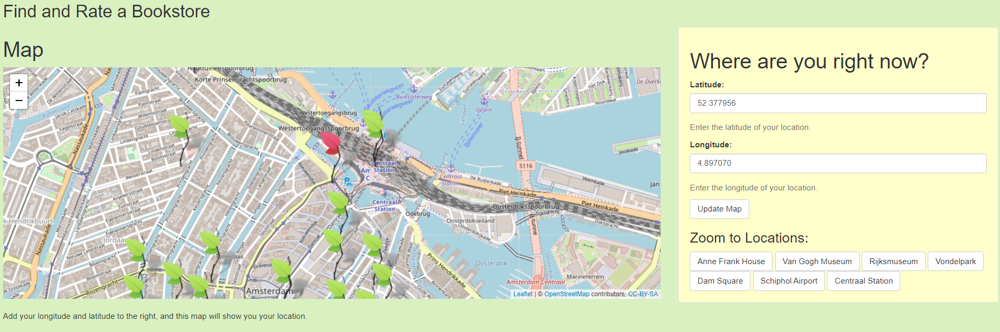
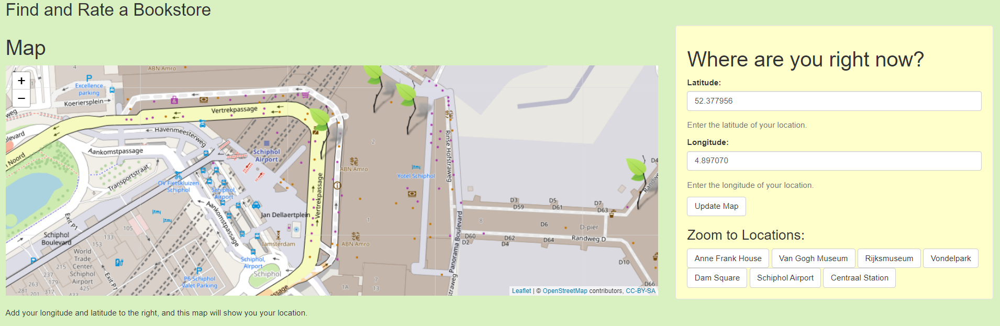

TITLE: **Find a Bookstore**  

Have you ever been in a new city and did not know where to buy a new book, souvenirs or postcards?
These are all things that are great at bookstores and usually better than the touristy souvenir shops. 
This app will allow you to find your nearest bookstores using your
location in longitude and latitude!

In order to find your location on the Map you need to type in your
coordinates into the two free fields on the left. Then a red leaf will appear where you are and the map will
zoom closer to your position. You can use your mouse or the +/- on
the map to zoom further in or out. You can also move around the map with your mouse.  
The more you zoom in, the more other things like restaurants, stores and
cafes will appear. So you can sit down and have a coffee after buying
your books :)    

This is an example of what the app looks like once you have typed in
your location (e.g. latitude: 52.377956, Longitude: 4.897070).
 Here the red leafs are your position and the green ones are the bookstores.  
 
 
  
When hovering your mouse over
a green leaf, the name of the bookstore, the GoogleMaps rating and the
address of it will appear in a little pop-up window.

This is how I generated the list of bookstores: 
I used a Google maps API and the googleway package to search for bookstores at different
locations. I looked for results in English and i did another search in
Dutch to make sure I get all the bookstores possible.

I then used the output to make a big data table with all the search
results of every location combined. I ended up with a csv file with 159
bookstores in Amsterdam and surrounding areas. This was a lot more than
I expected so I decided to focus the app on these regions.   

Since I wanted to focus on Amsterdam now, I added buttons to the app
were the user can click on some prominent Amsterdam sights and check out
what bookstores are in close proximity of that.    

For example you can click on the Schipol airport button and the app will zoom in on the airport for you and you can see that there are multiple bookstores in the airport. Then based on the ratings and location relative to your own location you can choose which one to go to.    

   

Happy Book Shopping :)
